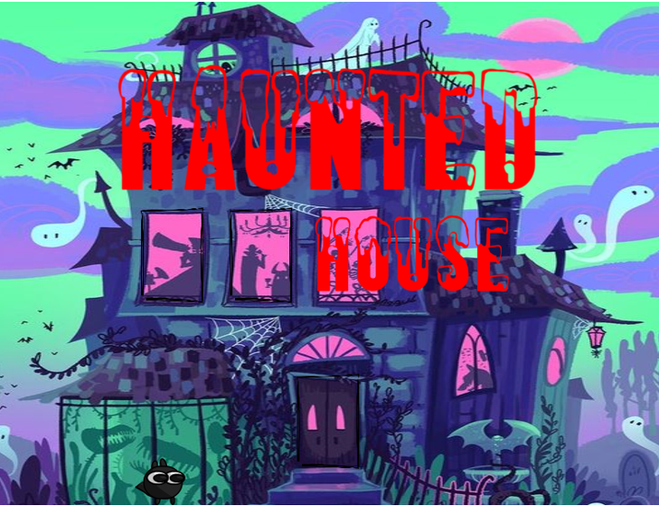
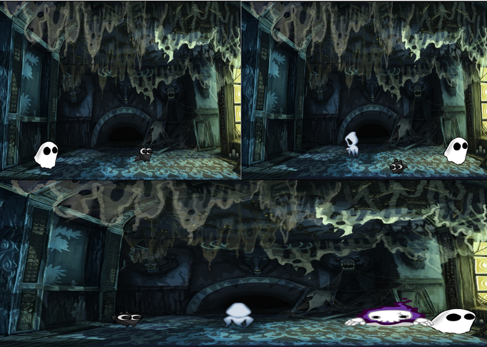

# *Phaser 3 Scene change, Video,audio and Spritesheet animation demo*

## What we are trying to do:
* In Phaser we have scene changing functions to help us navigate through our game.
* We are making 4 scenes in total. In 1st  scene we have ta Haunted house where a scary sound is playing, the house has a door and many windows.
* The windows on clicking takes us to two different jump scare videos. The door takes our player inside where roaming around to different spots makes some ghosts active.
* We have to figure out how we can escape the haunted house.
* The last scene is the scene with name of creators bouncing around.

## *Complete Code*

javascript
var GameScene1 = new Phaser.Class({

    Extends: Phaser.Scene,
    initialize:

        function GameScene1() {
        Phaser.Scene.call(this, { key: 'GameScene1' });
    },

    preload: function() {
        this.load.spritesheet('Char', 'Char.png', { frameWidth: 128, frameHeight: 128, endFrame: 44 });
        this.load.spritesheet('CharR', 'Char1.png', { frameWidth: 128, frameHeight: 128, endFrame: 44 });
        this.load.spritesheet('CharL', 'Char2.png', { frameWidth: 128, frameHeight: 128, endFrame: 44 });
        this.load.spritesheet('Ghost1', 'Ghost1.png', { frameWidth: 48, frameHeight: 48, endFrame: 39 });
        this.load.spritesheet('Ghost2', 'Ghost2.png', { frameWidth: 245, frameHeight: 250, endFrame: 8 });
        this.load.spritesheet('Ghost3', 'Ghost3.png', { frameWidth: 175, frameHeight: 180, endFrame: 12 });
        this.load.image('Scene1', 'Scene1.jpg');
        this.load.image('Scene2', 'Scene2.jpg');
        this.load.image('Yashit', 'Yashit.png');
        this.load.image('Anthima', 'Anthima.png');
        this.load.image('Amitabh', 'Amitabh.png');
        this.load.image('Haunted', 'Haunted.jpg');
        this.load.image('House', 'House.png');
        this.load.image('Door', 'Door.png');
        this.load.audio('theme', 'First.wav');
        this.load.audio('duck', 'Duck.wav');
        this.load.audio('scream', 'scream.wav');
        this.load.audio('GhostTheme', 'GhostTheme.mp3');
        this.load.video('wormhole1', '3.mp4', 'loadeddata', false, true);
        this.load.video('wormhole2', '4.mp4', 'loadeddata', false, true);
    },

    create: function() {
        scene1 = this.add.sprite(400, 380, 'Scene1');
        scene1.setScale(1.5, 1);

        door = this.add.sprite(400, 500, 'Door');
        door.setScale(0.15, 0.19);
        door.setInteractive({ useHandCursor: true });
        door.setInteractive().on('pointerdown', function() {
            this.scene.scene.start('GameScene2');
            music.destroy() = false;
            this.scene.scene.pause('GameScene1');
        });
        door1 = this.add.sprite(320, 302, 'Door');
        door1.setScale(0.15, 0.19);
        door1.setInteractive({ useHandCursor: true });
        door1.setInteractive().on('pointerdown', function() {
            this.scene.scene.start('GameScene3');
            music.destroy() = false;
            this.scene.scene.pause('GameScene1');
        });
        door2 = this.add.sprite(214, 302, 'Door');
        door2.setScale(0.15, 0.19);
        door2.setInteractive({ useHandCursor: true });
        door2.setInteractive().on('pointerdown', function() {
            this.scene.scene.start('GameScene4');
            music.destroy() = false;
            this.scene.scene.pause('GameScene1');
        });

        haunted = this.add.sprite(400, 150, 'Haunted');
        haunted.setScale(0.8);
        house = this.add.sprite(500, 300, 'House');
        house.setScale(0.5);

        this.anims.create({
            key: 'rightG',
            frames: this.anims.generateFrameNumbers('CharR', { start: 0, end: 44 }),
            frameRate: 25,
            repeat: -1
        });

        this.anims.create({
            key: 'leftG',
            frames: this.anims.generateFrameNumbers('CharL', { start: 0, end: 44 }),
            frameRate: 10,
            repeat: -1
        });

        this.anims.create({
            key: 'pauseG',
            frames: this.anims.generateFrameNumbers('Char', { start: 0, end: 44 }),
            frameRate: 15,
            repeat: -1
        });

        Char = this.physics.add.sprite(200, 600, 'Char').setScale(0.5);
        Char.setCollideWorldBounds(true);

        music = this.sound.add('theme');
        music.loop = true;
        music.play();

        cursors = this.input.keyboard.createCursorKeys();
    },

    update: function() {
        if (cursors.right.isDown) {
            Char.anims.play('rightG', true);
            Char.x += 2;
        } else if (cursors.left.isDown) {
            Char.anims.play('leftG', true);
            Char.x -= 2;
        } else {
            Char.anims.play('pauseG', true);
        }
    }
});

//create a scene with class
var GameScene2 = new Phaser.Class({
    Extends: Phaser.Scene,
    initialize:

        function GameScene() {
        Phaser.Scene.call(this, { key: 'GameScene2' });
    },

    create: function() {
        scene2 = this.add.sprite(400, 300, 'Scene2').setScale(0.8);

        cursors = this.input.keyboard.createCursorKeys();

        this.anims.create({
            key: 'rightG',
            frames: this.anims.generateFrameNumbers('CharR', { start: 0, end: 44 }),
            frameRate: 25,
            repeat: -1
        });

        this.anims.create({
            key: 'leftG',
            frames: this.anims.generateFrameNumbers('CharL', { start: 0, end: 44 }),
            frameRate: 10,
            repeat: -1
        });

        this.anims.create({
            key: 'pauseG',
            frames: this.anims.generateFrameNumbers('Char', { start: 0, end: 44 }),
            frameRate: 15,
            repeat: -1
        });

        this.anims.create({
            key: 'pauseG1',
            frames: this.anims.generateFrameNumbers('Ghost1', { start: 0, end: 7 }),
            frameRate: 10,
            repeat: -1
        });

        this.anims.create({
            key: 'pauseG2',
            frames: this.anims.generateFrameNumbers('Ghost2', { start: 0, end: 7 }),
            frameRate: 10,
            repeat: -1
        });

        this.anims.create({
            key: 'pauseG3',
            frames: this.anims.generateFrameNumbers('Ghost3', { start: 0, end: 11 }),
            frameRate: 15,
            repeat: -1
        });

        Char = this.physics.add.sprite(200, 550, 'Char').setScale(0.5);
        Char.setCollideWorldBounds(true);

        Ghost1 = this.physics.add.sprite(200, 480, 'Ghost1').setScale(2);
        Ghost1.setCollideWorldBounds(true);
        Ghost1.setVelocity(100, 0).setBounce(1, 0);
        Ghost1.visible = false;

        Ghost2 = this.physics.add.sprite(500, 500, 'Ghost2').setScale(0.4);
        Ghost2.setCollideWorldBounds(true);
        Ghost2.setVelocity(100, 0).setBounce(1, 0);
        Ghost2.visible = false;

        Ghost3 = this.physics.add.sprite(400, 450, 'Ghost3').setScale(1);
        Ghost3.setCollideWorldBounds(true);
        Ghost3.setVelocity(100, 0).setBounce(1, 0);
        Ghost3.visible = false;

        music1 = this.sound.add('GhostTheme');
        music1.loop = true;
        music1.play();

        cursors = this.input.keyboard.createCursorKeys();
    },

    update: function() {
        if (cursors.right.isDown) {
            if (Char.x != 700) {
                Char.anims.play('rightG', true);
                Char.x += 2;
            }
        } else if (cursors.left.isDown) {
            if (Char.x != 150) {
                Char.anims.play('leftG', true);
                Char.x -= 2;
            }
        } else if (cursors.up.isDown) {
            if (Char.y != 480) {
                Char.anims.play('leftG', true);
                Char.y -= 2;
            }
        } else if (cursors.down.isDown) {
            if (Char.y != 550) {
                Char.anims.play('rightG', true);
                Char.y += 2;
            }
        } else if (Char.x <= 200 && Char.y <= 500) {
            Ghost3.visible = true;
            Char.setInteractive({ useHandCursor: true });
            Char.setInteractive().on('pointerdown', function() {
                this.scene.scene.start('GameScene5');
                music1.destroy() = false;
                this.scene.scene.pause('GameScene2');
            });
        } else if (Char.x >= 500 && Char.y >= 400) {
            Ghost1.visible = true;
        } else if (Char.x >= 180 && Char.y <= 500) {
            Ghost2.visible = true;
        } else {
            Char.anims.play('pauseG', true);

            Ghost1.anims.play('pauseG1', true);

            Ghost2.anims.play('pauseG2', true);

            Ghost3.anims.play('pauseG3', true);
        }
    }
});

var GameScene3 = new Phaser.Class({
    Extends: Phaser.Scene,
    initialize:

        function GameScene() {
        Phaser.Scene.call(this, { key: 'GameScene3' });
    },

    create: function() {
        var vid = this.add.video(400, 300, 'wormhole1').setScale(1);
        vid.play(true);
        music2 = this.sound.add('duck');
        music2.loop = true;
        music2.play();

        var txt1 = this.add.text(400, 20, 'Back!');
        txt1.setInteractive({ useHandCursor: true });
        txt1.setInteractive().on('pointerdown', function() {
            this.scene.scene.start('GameScene1');
            music2.destroy() = false;
            this.scene.scene.pause('GameScene2');
        });
    }
});

var GameScene4 = new Phaser.Class({
    Extends: Phaser.Scene,
    initialize:

        function GameScene() {
        Phaser.Scene.call(this, { key: 'GameScene4' });
    },

    create: function() {
        var vid = this.add.video(400, 300, 'wormhole2').setScale(1.5);
        vid.play(true);
        music3 = this.sound.add('scream');
        music3.loop = true;
        music3.play();

        var txt2 = this.add.text(400, 10, 'Back!');
        txt2.setInteractive({ useHandCursor: true });
        txt2.setInteractive().on('pointerdown', function() {
            this.scene.scene.start('GameScene1');
            music3.destroy() = false;
            this.scene.scene.pause('GameScene2');
        });
    }
});

var GameScene5 = new Phaser.Class({
    Extends: Phaser.Scene,
    initialize:

        function GameScene() {
        Phaser.Scene.call(this, { key: 'GameScene5' });
    },

    create: function() {
        logo1 = this.physics.add.image(100, 100, 'Yashit');
        logo1.setScale(0.6);
        logo1.setVelocity(100, 0);
        logo1.setBounce(1, 1);
        logo1.setGravityY(300);
        logo1.setCollideWorldBounds(true);

        logo2 = this.physics.add.image(500, 300, 'Anthima');
        logo2.setScale(0.6);
        logo2.setVelocity(-100, 0);
        logo2.setBounce(1, 1);
        logo2.setGravityY(300);
        logo2.setCollideWorldBounds(true);

        logo3 = this.physics.add.image(200, 450, 'Amitabh');
        logo3.setScale(0.6);
        logo3.setVelocity(100, 0);
        logo3.setBounce(1, 1);
        logo3.setGravityY(300);
        logo3.setCollideWorldBounds(true);
    }
});

var config = {
    type: Phaser.AUTO,
    width: 800,
    height: 600,
    physics: {
        default: 'arcade',
        arcade: {
            gravity: 10,
        }
    },

    //set background color
    backgroundColor: 0x00000,
    scale: {
        //we place it in the middle of the page.
        autoCenter: Phaser.Scale.CENTER_BOTH
    },

    scene: [GameScene1, GameScene2, GameScene3, GameScene4, GameScene5],

    audio: {
        disableWebAudio: true
    }
};

var game = new Phaser.Game(config);

#Created by Anthima
